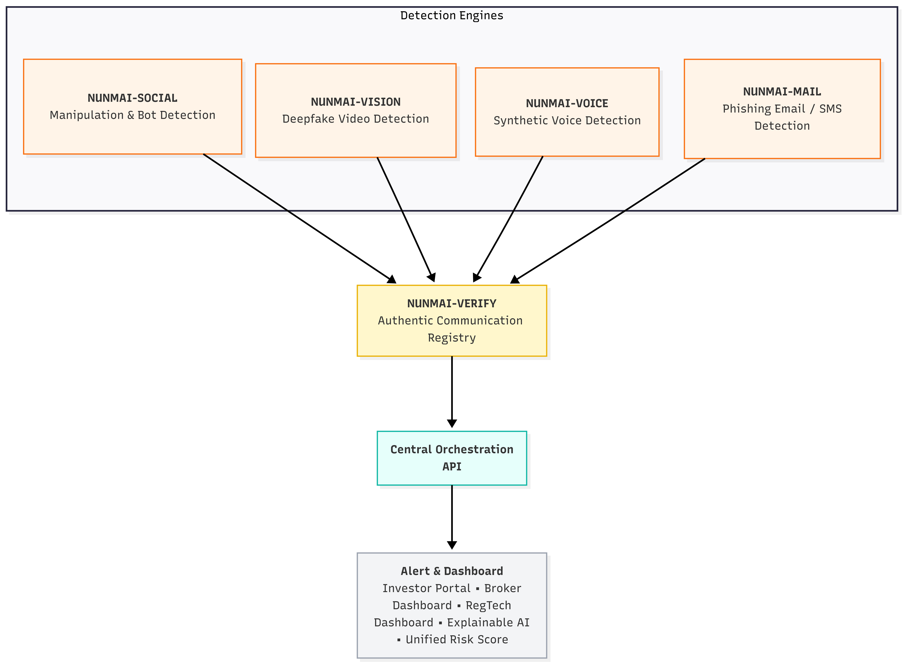

# NUNM.AI: Unified Multi-Modal Threat Detection & Verification Engine

NUNM.AI is a highly modular, multi-vector threat intelligence platform designed to ingest, correlate, and cryptographically verify data across four primary attack surfaces: Email, Vision (Video Deepfakes), Voice (Synthetic Audio), and Social Media (Bot Amplification). 

Rather than relying on isolated security tools, NUNM.AI employs a **Central Orchestration Architecture** to evaluate heterogeneous data streams, assign a unified risk score, and generate a non-tamper evident cryptographic Threat Report.

---

## System Architecture



The NUNM.AI ecosystem is heavily decentralized into specialized microservices, all tethered together via the Central Orchestration API and interacted with through a rigorous Terminal CLI frontend.

---

## Core Microservices Deep-Dive

### 1. Nunmai-Mail (Phishing & Payload Detection)
The Mail module performs deep static and heuristic analysis on `.eml` and raw email source data.
* **Header Analysis**: Strict verification of `SPF`, `DKIM`, and `DMARC` alignment to detect domain spoofing.
* **Body/Context Analysis**: NLP-driven intent classification to detect social engineering and urgency-based phishing vectors.
* **Attachment Scanning**: Static analysis of embedded payloads (PDFs, DOCs) for known malicious signatures or obfuscated macro scripts.

### 2. Nunmai-Vision (Deepfake & Spatial-Temporal Analysis)
The Vision module is a heavy-compute pipeline dedicated to identifying synthetic generative video content.
* **Frame Extraction & Localization**: Utilizes OpenCV for temporal chunking and RetinaFace for precise facial landmark detection.
* **Spatial Feature Extraction (CNN)**: Analyzes localized faces for micro-artifacts, GAN blending edges, and pixel-level inconsistencies that indicate generative manipulation.
* **Temporal Feature Extraction (LSTM)**: Evaluates chronological coherence, including unnatural blinking frequencies and desynchronized audio-visual lip-sync.

### 3. Nunmai-Voice (Synthetic Audio Detection)
The Voice module evaluates acoustic streams to differentiate organic human speech from AI-synthesized models (e.g., ElevenLabs, VITS).
* **Signal Preprocessing**: Applies noise removal algorithms and resamples audio streams to a normalized 16kHz format.
* **Formant Analysis**: Extracts Mel-frequency cepstral coefficients (MFCCs) and spectral formants.
* **Inference Pipeline**: Passes temporal acoustic features through a 1D-CNN and LSTM context evaluation layer to identify known generative acoustic signatures.

### 4. Nunmai-Social (Bot & Disinformation Amplification)
The Social module focuses on metadata and behavioral heuristics to detect automated bot networks and coordinated disinformation campaigns.
* **Heuristic Evaluation**: Analyzes account creation velocity, follower-to-following ratios, and posting frequencies.
* **Content NLP**: Evaluates caption/bio text for algorithmic amplification patterns and coordinated inauthentic behavior (CIB).

### 5. Nunmai-Verify (Cryptographic Engine)
The Verification module acts as the final arbiter of trust for the NUNM.AI pipeline.
* **Global Registry Cross-Check**: Queries a trusted registry for known malicious domains, phone numbers, and social handles (Note: Biometric data from Vision/Voice bypasses the global registry to maintain PII compliance).
* **Cryptographic Signing**: Generates a unified JSON Threat Report payload containing an aggregated risk score and a unique `NUNM.AI-VERIFY HASH`.
* **QR Signature Generation**: The payload is encoded into a non-tamper evident SVG/Canvas QR Code, allowing instant offline verification of the threat report by any scanning device.

---

## Frontend: Central Orchestration UI

The user interface (`/frontend`) is a Vite/React SPA designed with a strict, low-latency, "Terminal CLI" hacker aesthetic. It acts as the binder for the microservices.

### Technical UI Features
* **Grid-Based Window Paning**: Built on strict CSS Grid and Flexbox architecture to mimic a `tmux` environment.
* **Interactive Ingestion Forms**: Click-to-upload native file browsers, `URL.createObjectURL` video rendering, and dense metadata forms.
* **Asynchronous Buffer Simulation**: Simulates real-time memory allocation (20s buffering) and deep-compute chunking (30s sequential logging) to visualize the backend AI inference pipeline in real-time.
* **Client-Side PDF Compilation**: Utilizes `html2pdf.js` to natively capture the DOM and render a pristine, downloadable PDF of the Unified Threat Report and QR signature without requiring a backend rendering server.

---

## Data Flow & Ingestion Pipeline

1. **Ingestion**: The user selects a module via the UI and provides the required payload (raw email text, `.mp4` video, `.wav` audio, or social metadata).
2. **Buffering & Decoding**: For heavy media (Vision/Voice), the payload is buffered into memory and preprocessed (OpenCV/Audio resampling).
3. **Inference**: The data is passed through the respective module's AI ensemble (CNN/LSTM/NLP).
4. **Correlation**: The Central Orchestration API receives the individual threat scores and calculates an **Aggregated Risk Score**.
5. **Verification & Signature**: `Nunmai-Verify` cryptographically hashes the final report.
6. **Reporting**: The UI presents the findings, generates the QR code, and allows the user to export the non-tamper evident PDF.

---

## Setup & Installation

### Frontend Deployment
```bash
cd frontend
npm install
npm run dev
```
*The UI will be accessible at `http://localhost:5173`.*

### Backend Microservices
*(Deployment instructions for FastAPI / Python microservices will vary based on Docker containerization and GPU availability for Vision/Voice models).*

---

## Technology Stack

### Frontend (Central Orchestration)
* **Framework**: React 18, Vite (for optimized builds and HMR)
* **Styling**: Vanilla CSS with strict variable design tokens (CSS Grid/Flexbox)
* **PDF Generation**: `html2pdf.js` (DOM-to-Canvas rendering)
* **Cryptography / Verification**: `qrcode.react` (SVG-based non-tamper QR signatures)

### Backend (AI Microservices)
* **Framework**: FastAPI (Python 3.10+) for async API orchestration
* **Computer Vision**: OpenCV (Frame extraction), RetinaFace (Localization), PyTorch (CNN/LSTM ensembles)
* **Audio Processing**: Librosa (MFCC extraction, Resampling), TensorFlow/Keras (1D-CNN temporal analysis)
* **NLP & Text**: HuggingFace Transformers (BERT/RoBERTa) for Mail/Social intent classification
* **Security & Auth**: JWT (JSON Web Tokens), Cryptographic Hash (SHA-256 for Verify signatures)

---

*System Architect: Jonah | NUNM.AI © 2026*
